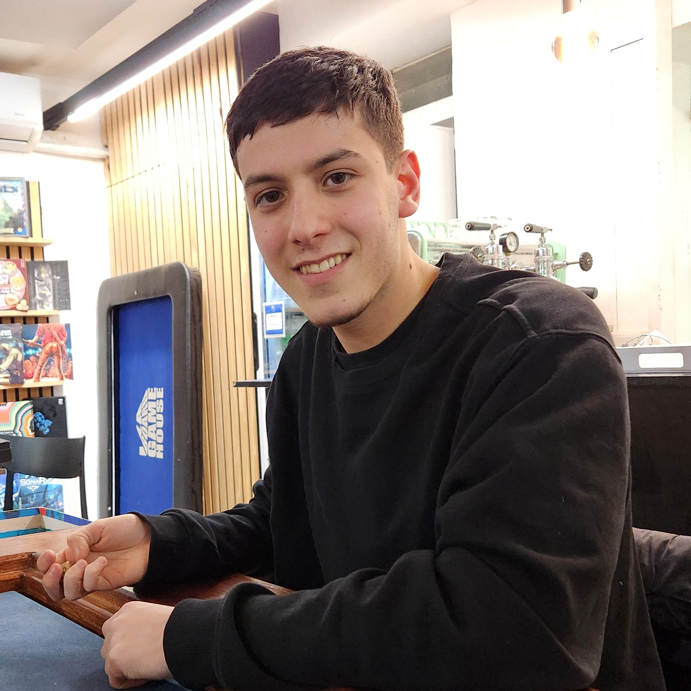

# About Me

Hi! I am a Computer Scientist from the University of Buenos Aires (UBA) && Software Developer.

I am interested in Compilers development, ML and HPC.

## Experience

- [Research Intern](https://icc.fcen.uba.ar), Instituto de Ciencias de la Computación, HPC Lab, 2026

---

## News

- **Sep 2026**: Presenting my HPC work on DL models optimization for RISC-V at [CARLA 2026](https://carlaconference.org/).
- **Mar 2026**: Moving back to Buenos Aires to continue my research at [ICC](https://icc.fcen.uba.ar).
- **Jun 2025**: I was selected for an HPC internship at [FER](https://www.fer.unizg.hr) under an Erasmus+ mobility program.